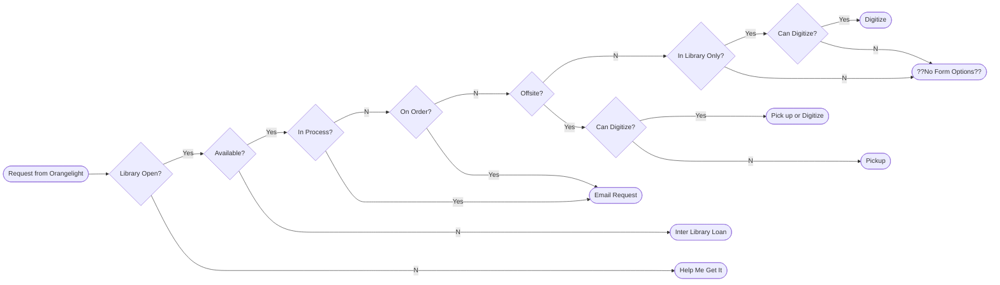

```mermaid
graph LR;
A([Request from Orangelight])-->B{Library Open?}
B--Yes-->C{Available?}
B--No-------->D([Help Me Get It])
C--Yes-->E{In Process?}
C--No------->F([Inter Library Loan])
E--No-->G{On Order?}
E--Yes------>H([Email Request])
G--No-->I{"Offsite?"}
G--Yes-->H
I--No-->J{In Library Only?}
J--Yes-->K{Can Digitize?}
K--Yes-->L([Digitize])
K--No-->M([??No Form Options?? ])
J--No-->M
I--Yes-->N{Can Digitize?}
N--Yes--->O([Pick up or Digitize])
N--No--->P([Pickup])
```
