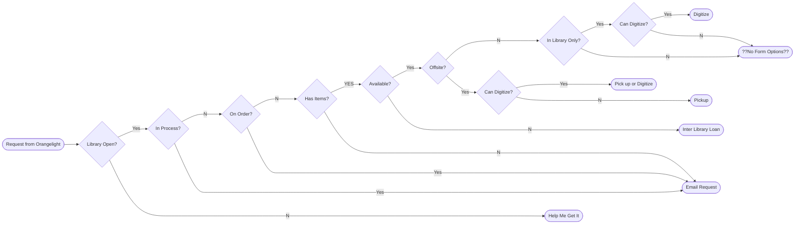

```mermaid
graph LR;
REQ([Request from Orangelight])-->OPEN{Library Open?}
OPEN--Yes-->INPROCESS{In Process?}
OPEN--No--------->HELP([Help Me Get It])
INPROCESS--No-->ONORDER{On Order?}
INPROCESS--Yes-->EMAIL([Email Request])
ONORDER--No-->ITEMS{Has Items?}
ITEMS--YES-->AVAIL{Available?}
AVAIL--Yes-->OFFSITE{"Offsite?"}
ITEMS--No------>EMAIL
ONORDER--Yes-->EMAIL
AVAIL--No----->ILL([Inter Library Loan])
OFFSITE--No-->INLIB{In Library Only?}
INLIB--Yes-->DIG{Can Digitize?}
DIG--Yes-->L([Digitize])
DIG--No-->NOOPT([??No Form Options?? ])
INLIB--No-->NOOPT
OFFSITE--Yes-->OFFSITEDIG{Can Digitize?}
OFFSITEDIG--Yes--->PICKDIG([Pick up or Digitize])
OFFSITEDIG--No--->PICK([Pickup])
```
